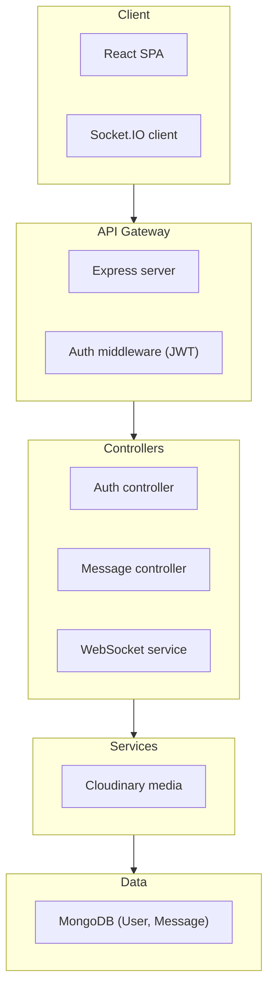
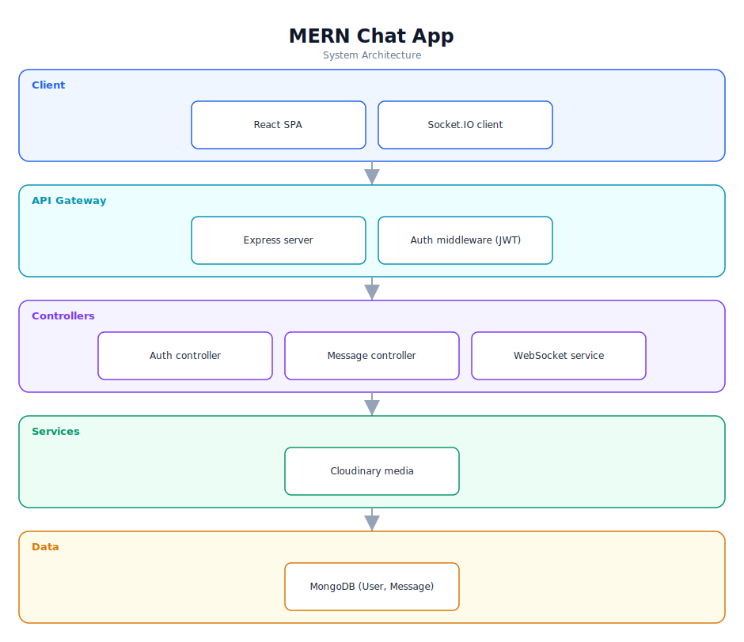

# MERN Chat App — Software Documentation

> Real-time messaging with authentication, built on MongoDB, Express, React, and Node.

**Repository:** [`chat-app`](https://github.com/Monametsi-s/chat-app)  
**Type:** Full-stack web application (MERN)  
**Status:** Complete / functional

---

## 1. Overview

A full-stack real-time chat application built on the MERN stack. It provides secure authentication (bcrypt password hashing and JWT sessions), real-time messaging over Socket.IO, and media handling via Cloudinary. The backend is an Express API split into authentication and messaging controllers with a WebSocket service for live delivery; the frontend is a React single-page application.

## 2. System Architecture

The diagram below shows the high-level architecture and how data flows between layers. It renders automatically on GitHub (Mermaid) and is also committed as a vector image ([`architecture.svg`](architecture.svg)).



<p align="center"></p>

### 2.1 Component responsibilities

| Layer | Responsibility |
|---|---|
| **Client** | React SPA with a Socket.IO client for live updates. |
| **API Gateway** | Express HTTP server with JWT auth middleware as the single entry point. |
| **Controllers** | Auth and Message controllers plus a WebSocket service for real-time delivery. |
| **Services** | Cloudinary for image/media storage and processing. |
| **Data** | MongoDB via Mongoose models for users and messages. |

## 3. Technology Stack

| Area | Technology |
|---|---|
| Frontend | React |
| Backend | Node.js + Express |
| Realtime | Socket.IO |
| Database | MongoDB + Mongoose |
| Auth | JWT + bcrypt |
| Media | Cloudinary |

## 4. Assumed User Requirements

_These requirements are inferred from the project's purpose and feature set; they document the intended behaviour rather than a formally agreed specification._

### 4.1 Functional requirements

- **FR-01** — Register and authenticate users with hashed passwords and JWT sessions.
- **FR-02** — Send and receive messages in real time between authenticated users.
- **FR-03** — Persist message history in the database.
- **FR-04** — Support media/image messages via Cloudinary.
- **FR-05** — Seed initial data for development.

### 4.2 Representative user stories

- As a user, I want to log in securely and start chatting immediately.
- As a user, I want messages to appear instantly without refreshing.
- As a user, I want to share images in a conversation.

### 4.3 Non-functional requirements

- Passwords must be hashed; tokens must be signed and verified.
- Real-time latency should be low for a responsive feel.
- The API should validate inputs and handle errors consistently.

## 5. Assumed System Requirements

### 5.1 End-user (runtime) requirements

- A modern desktop or mobile web browser (latest Chrome, Edge, Firefox, or Safari) with JavaScript enabled.
- A stable internet connection for the initial page load.

### 5.2 Server / hosting requirements

- Node.js runtime to host the Express + Socket.IO server.
- A MongoDB instance (Atlas or self-hosted).
- WebSocket-capable hosting.

### 5.3 External services & API keys

- Cloudinary account (cloud name, API key/secret).
- MongoDB connection string.
- A JWT signing secret.

### 5.4 Developer / build requirements

- Node.js 18+ and npm (or yarn/pnpm).
- Git for cloning the repository.
- A code editor such as VS Code (recommended).
- Separate `backend/` and `frontend/` installs; `.env` for DB, JWT, and Cloudinary.

## 6. Data Model

`User` { name, email, passwordHash, avatar }; `Message` { senderId, receiverId, text, mediaUrl, createdAt }. Relationships are by user id reference.

## 7. Setup & Installation

```bash
git clone https://github.com/Monametsi-s/chat-app.git
cd chat-app
# backend
cd backend && npm install && npm run dev
# frontend (new terminal)
cd ../frontend && npm install && npm run dev
```

## 8. Assumptions & Future Considerations

- Add typing indicators and online/offline presence.
- Add rate limiting on auth routes.
- Document deployment for the split frontend/backend.

---

<sub>This document was generated as part of a portfolio-wide documentation pass. User and system requirements are **assumed** from the codebase, README, and project intent, and should be validated against real product goals before being treated as authoritative.</sub>
